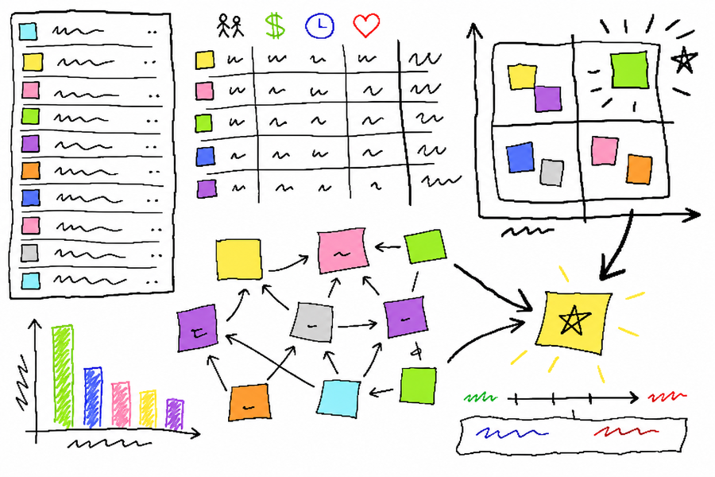

# PRD Skill



Generate a structured Product Requirements Document with product-type templates and a 10-point quality checklist. Part of the Personal Corp product management toolkit.

## Problem

A feature idea is clear in conversation but not ready for design or engineering — missing goals, rules, acceptance criteria, and analytics.

## Solution

The agent turns a feature description into a delivery-ready PRD: background, goals, module design, Given-When-Then acceptance criteria, analytics events, and a self-check.

## When to use

- Before design or sprint planning
- After prioritization, for top backlog items
- When stakeholders need a shared requirements doc

## Installation

```bash
cp -r skills/pm-prd ~/.claude/skills/
```

## Example Prompt

```text
Write a PRD for a loyalty points marketplace. Target users are mobile app members. Goal: increase repeat purchase rate.
```

Slash command: `/pm-prd`

## Related skills

- /pm-competitive
- /pm-prioritize
- /pm-user-stories

## See Also

- [SKILL.md](SKILL.md) — full skill definition
- [README.ru.md](README.ru.md) — Russian version
